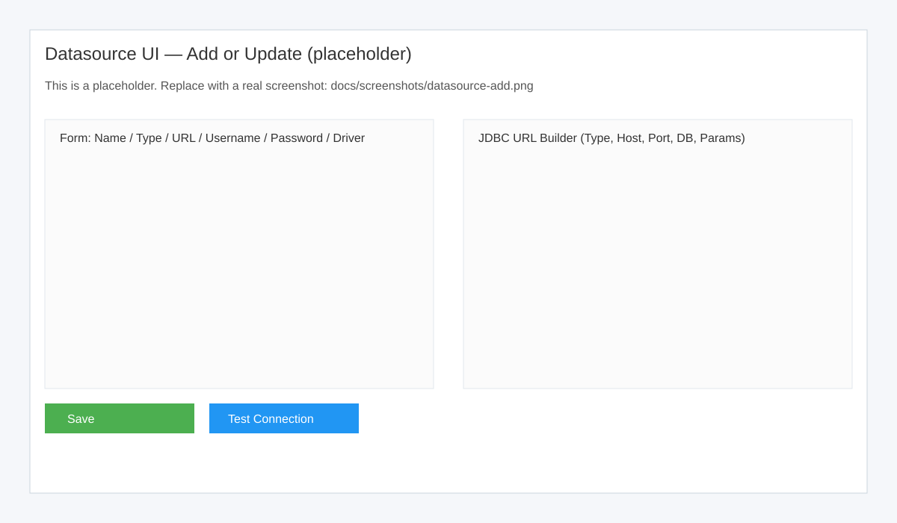
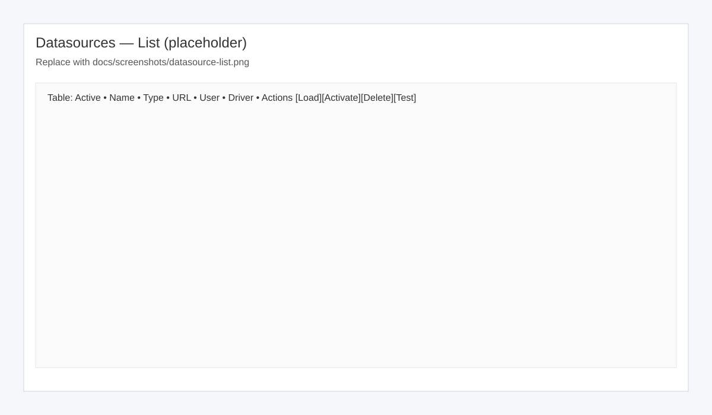
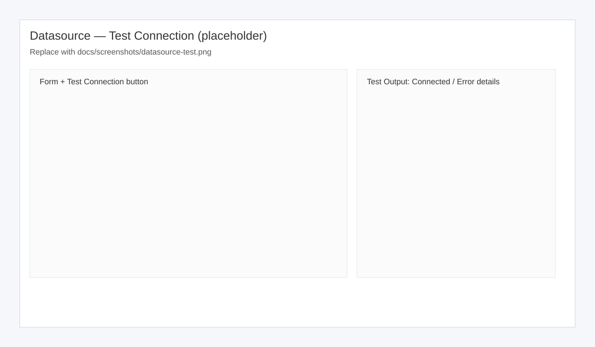
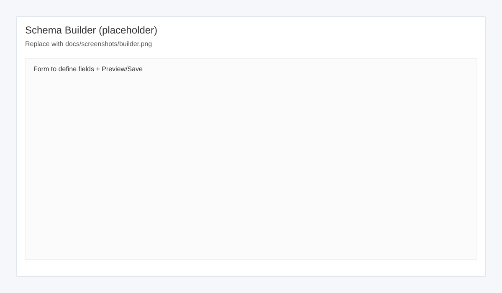
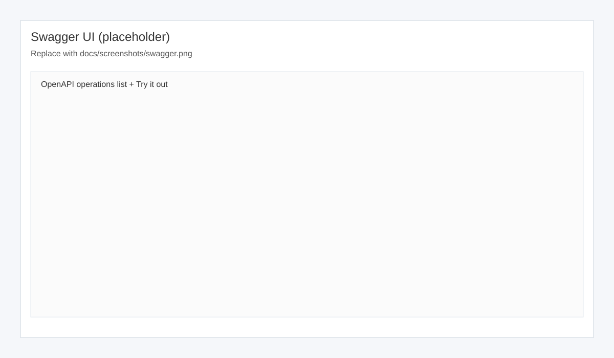

# AppBana — User Guide

Welcome! This guide walks you through installing, configuring, and using AppBana end to end.

What is AppBana?
- A metadata-driven MVP. Design entities in a browser, AppBana persists the schema, auto-creates/migrates a table, and serves generic CRUD APIs.
- No heavy framework; it’s plain Java + HttpServer + JDBC + HikariCP.

Contents
- Prerequisites
- Quick start
- Configuration (port, config file, environment overrides)
- Authentication (optional)
- HTTPS (optional)
- Datasource management (UI + API)
- Designing entities (Schema Builder)
- Using the runtime CRUD APIs
- OpenAPI & Swagger UI
- Health & readiness
- Troubleshooting & tips
- Security notes
- UI step-by-step walkthroughs (all features)
- Recipes (common tasks)

Prerequisites
- Java 25 (required)
- macOS/Linux or Windows
- Internet access (for Swagger UI CDN), optional
- Optional: Docker (to run Postgres locally)

Quick start
1) Build the app
```bash
./mvnw -DskipTests package
```
2) Run it
```bash
java -jar target/app-bana-1.0-SNAPSHOT-fat.jar
# If 8080 is busy, override the port
java -Dappbana.port=8081 -jar target/app-bana-1.0-SNAPSHOT-fat.jar
```
3) Open these URLs
- Datasource UI: http://localhost:8080/ui/datasource
- Schema Builder: http://localhost:8080/ui/builder
- Swagger UI: http://localhost:8080/ui/swagger
- OpenAPI JSON: http://localhost:8080/openapi.json
- API endpoints index (machine-readable): http://localhost:8080/api/endpoints
- Health: http://localhost:8080/health and readiness: http://localhost:8080/ready

Smoke test (optional)
- For a fast, repeatable end-to-end check of existing UIs and key routes, follow `UI_SMOKE.md`. Run it against http://localhost:8080 (or your configured port).

Note: If authentication is enabled (see below), enter your token in the top bar of the UIs (builder, datasource, swagger) to authorize requests.

## Token quickstart (optional)
- Set tokens when starting the server (zsh)
```bash
export APPBANA_ADMIN_TOKEN=admin123
export APPBANA_READ_TOKEN=read123
java -jar target/app-bana-1.0-SNAPSHOT-fat.jar
```
- In the UIs (builder, datasource, swagger): paste your token in the “Auth token” box and click “Save token”.
- With curl (either header works)
```bash
export TOKEN=admin123
# Using custom header
curl -sS http://localhost:8080/schema -H "X-AppBana-Token: $TOKEN"
# Or using Bearer auth
curl -sS http://localhost:8080/schema -H "Authorization: Bearer $TOKEN"
```

Configuration
- Port
  - System property: `-Dappbana.port=9090`
  - Env var: `APPBANA_PORT=9090`
- Config file
  - Default: `data/appbana-config.json`
  - Override path: env `APPBANA_CONFIG` or `-Dappbana.config=...`
- Env overrides for connection (optional)
  - APPBANA_JDBC_URL, APPBANA_DB_USER, APPBANA_DB_PASS, APPBANA_DB_DRIVER
  - Or equivalent system properties: `-Dappbana.jdbc.url`, `-Dappbana.db.user`, `-Dappbana.db.pass`, `-Dappbana.db.driver`

HTTPS (optional)
- AppBana can serve HTTPS alongside HTTP when enabled.
- Config fields: `httpsEnabled`, `httpsPort` (default 8443), `keystorePath`, `keystorePassword`, `keyPassword?`, `redirectHttpToHttps`.
- Env/system props: `APPBANA_HTTPS_ENABLED`, `APPBANA_HTTPS_PORT`, `APPBANA_KEYSTORE_PATH`, `APPBANA_KEYSTORE_PASSWORD`, `APPBANA_KEY_PASSWORD`, `APPBANA_REDIRECT_HTTP_TO_HTTPS` (or `-Dappbana.*` equivalents).
- Quickstart (self-signed PKCS12):
```bash
# 1) Generate a local PKCS12 keystore (macOS zsh)
mkdir -p certs
keytool -genkeypair -alias appbana -keyalg RSA -keysize 2048 -storetype PKCS12 \
  -keystore certs/keystore.p12 -storepass changeit -keypass changeit \
  -dname "CN=localhost, OU=Dev, O=AppBana, L=Local, S=Local, C=US"

# 2) Start the app with HTTPS enabled (and redirect HTTP→HTTPS)
APPBANA_HTTPS_ENABLED=true \
APPBANA_KEYSTORE_PATH=certs/keystore.p12 \
APPBANA_KEYSTORE_PASSWORD=changeit \
APPBANA_KEY_PASSWORD=changeit \
APPBANA_HTTPS_PORT=8443 \
APPBANA_REDIRECT_HTTP_TO_HTTPS=true \
java -jar target/app-bana-1.0-SNAPSHOT-fat.jar

# 3) Visit
open https://localhost:8443/ui/builder  # accept the self-signed cert
```
- Notes: With `redirectHttpToHttps=true`, any request on HTTP port (default 8080) returns 308 to the HTTPS URL.

Authentication (optional)
- AppBana supports simple token-based auth. When no tokens are configured, all endpoints are open (development mode).
- Configure tokens in the config file or via environment/system properties:
  - Config fields: `adminToken` (read-write) and `readToken` (read-only)
  - Env vars: `APPBANA_ADMIN_TOKEN`, `APPBANA_READ_TOKEN`
  - System props: `-Dappbana.admin.token=...`, `-Dappbana.read.token=...`
- Client headers (either works):
  - `X-AppBana-Token: <token>`
  - `Authorization: Bearer <token>`
- Authorization rules when tokens are set:
  - Read-only (readToken or adminToken): GET /schema, GET /schema/{name}, GET /api/*, GET /openapi.json, GET /ui/datasource/list|config|health
  - Admin (adminToken only): POST /schema (apply/preview), POST /api/* (writes), PUT/DELETE /api/*, POST /ui/datasource/save|test|activate|delete
- UIs: builder.html, datasource.html, and swagger.html include an “Auth token” box. Saving the token stores it in localStorage so all UI requests send it automatically.
- Curl examples with token
```bash
# set your token for convenience
export TOKEN=admin123
# Save a schema (admin)
curl -sS -X POST http://localhost:8080/schema \
  -H 'Content-Type: application/json' \
  -H "X-AppBana-Token: $TOKEN" \
  --data-binary '{"name":"contact","fields":[{"name":"id","type":"long","primaryKey":true,"autoIncrement":true}]}'
# List schemas (read)
curl -sS http://localhost:8080/schema -H "Authorization: Bearer $TOKEN"
```

Datasource management
Use the Datasource UI at /ui/datasource to:
- Add/Update
- Activate (switch active datasource)
- Delete
- Test Connection (form-level, and per-row in the list)

Fields
- Required basics: name, type, JDBC URL (or build it), username, password, driver
- JDBC URL Builder (optional):
  - Builds URLs for H2 (file/mem), Postgres, MySQL, MariaDB, SQL Server, Oracle, SQLite from host/port/db + params
  - Enable Auto-build to keep URL synced as you edit
- Server-side URL build (API):
  - If you POST to save without `url`, the server builds it from components: { type, host, port, dbname, params }, plus H2/SQLite extras.
- Pool settings (optional): maxPoolSize, minIdle, connectionTimeoutMs, idleTimeoutMs, maxLifetimeMs, autoCommit, poolName
  - Defaults when omitted: maxPoolSize=10, minIdle=2, connectionTimeoutMs=30000, idleTimeoutMs=600000, maxLifetimeMs=1800000, autoCommit=true, poolName="appbana-<name>"

Run Postgres in Docker (zsh-safe quoting for #)
```bash
docker run --name appbana-pg -d \
  -e POSTGRES_USER=sa \
  -e POSTGRES_PASSWORD='Password_123#' \
  -e POSTGRES_DB=appbana \
  -p 5432:5432 \
  postgres:16
```
Create a Postgres datasource (API)
```bash
curl -sS -X POST http://localhost:8080/ui/datasource/save \
  -H 'Content-Type: application/json' \
  --data-binary '{
    "name": "pg",
    "type": "postgres",
    "host": "localhost",
    "port": "5432",
    "dbname": "appbana",
    "username": "sa",
    "password": "Password_123#",
    "driver": "org.postgresql.Driver"
  }'
```
Test the connection (UI)
- Click “Test Connection” on the form (uses current inputs)
- Click “Test” in the list row (tests a saved datasource by name)

Test the connection (API)
```bash
curl -sS -X POST http://localhost:8080/ui/datasource/test \
  -H 'Content-Type: application/json' \
  --data-binary '{"name":"pg"}'
# Or provide components to have the server build the URL:
curl -sS -X POST http://localhost:8080/ui/datasource/test \
  -H 'Content-Type: application/json' \
  --data-binary '{
    "type":"postgres","host":"localhost","port":"5432","dbname":"appbana",
    "username":"sa","password":"Password_123#","driver":"org.postgresql.Driver"
  }'
```

Designing entities (Schema Builder)
1) Visit /ui/builder
2) Define a schema (example):
```json
{
  "name": "contact",
  "fields": [
    {"name":"id","type":"long","primaryKey":true,"autoIncrement":true},
    {"name":"firstName","type":"string","length":100,"required":true},
    {"name":"age","type":"int","min":0}
  ]
}
```
3) Preview migration
- POST to `/schema?preview=true` with the JSON; you’ll get a list of DDL statements.
4) Save schema
- POST to `/schema` with the JSON to persist and apply migrations.
5) List/load schemas (optional)
- GET `/schema` — list saved schema names (supports `?page=&size=&q=`)
- GET `/schema/{name}` — fetch a specific schema JSON

Using the runtime CRUD APIs
- After saving a schema named `contact`, CRUD endpoints are available:
  - POST /api/contact — create
  - GET /api/contact — list
  - GET /api/contact/{id} — get
  - PUT /api/contact/{id} — update
  - DELETE /api/contact/{id} — delete
- Tip: Discover available entity endpoints programmatically at `GET /api/endpoints`.

Examples (replace port if overridden)
```bash
# Optional: supply token if auth is enabled
export TOKEN=read123

# Create (requires admin token)
curl -sS -X POST http://localhost:8080/api/contact \
  -H 'Content-Type: application/json' \
  -H "X-AppBana-Token: $TOKEN" \
  -d '{"firstName":"Ada","age":36}'

# List (read)
curl -sS http://localhost:8080/api/contact -H "Authorization: Bearer $TOKEN"

# Get by id (read)
curl -sS http://localhost:8080/api/contact/1 -H "X-AppBana-Token: $TOKEN"

# Update (admin)
curl -sS -X PUT http://localhost:8080/api/contact/1 \
  -H 'Content-Type: application/json' \
  -H "Authorization: Bearer $TOKEN" \
  -d '{"age":37}'

# Delete (admin)
curl -sS -X DELETE http://localhost:8080/api/contact/1 -H "X-AppBana-Token: $TOKEN"
```

OpenAPI & Swagger UI
- Spec: GET /openapi.json
- UI: /ui/swagger (renders the spec)
- If auth is enabled, enter your token in the top bar and click Save token; the UI will include it automatically for fetching the spec and for Try it out requests.
- Tip: Re-open Swagger after adding schemas to see new endpoints.

Health & readiness
- GET `/health` → `{ "status": "UP" }` (process liveness)
- GET `/ready` → `{ ok: boolean, activeDatasource?: string, dbProduct?: string, dbVersion?: string, elapsedMs: number, error?: string }` (DB readiness)

Troubleshooting & tips
- Wrong credentials
  - Use /ui/datasource “Test Connection” (form or per-row) and fix settings.
  - The server still starts even if init fails; check logs.
- Port already in use
  - Run with `-Dappbana.port=8081`.
- Driver not found
  - Ensure the `driver` matches the type (e.g., Postgres → org.postgresql.Driver).
- H2 file locks
  - Close other processes using the file; use H2 mem mode for quick tests.
- Slow or failing connections
  - Use the Test endpoint (it times out quickly). Consider tuning pool settings.
- Config file shape
  - If only root fields are present, AppBana seeds a default datasource and marks it active.

Security notes
- Auth is optional. If `adminToken`/`readToken` are not set, endpoints are open (development mode).
- When tokens are set, read operations require read/admin token; write operations require admin token.
- UIs provide a token input; tokens are stored locally in the browser (localStorage) for convenience.
- For production, place AppBana behind TLS (reverse proxy) and restrict access to admin endpoints.

UI step-by-step walkthroughs (all features)

A) Datasource UI — Add a new datasource



1) Open http://localhost:8080/ui/datasource
2) In “Add or Update”, fill:
   - Name: a short identifier (e.g., pg)
   - Type: select your DB (e.g., PostgreSQL)
   - JDBC URL: either paste the full URL, or leave it empty and use the Builder below
   - Username / Password: your DB credentials
   - Driver: leave blank to use the suggested placeholder, or set explicitly
3) (Optional) Use the JDBC URL Builder section:
   - Tick “Auto-build URL from fields” to keep URL synced
   - For Postgres: Host=localhost, Port=5432, Database=appbana → URL becomes jdbc:postgresql://localhost:5432/appbana
   - For H2:
     * File mode: set File path (e.g., ./data/appbana), AUTO_SERVER=TRUE is added
     * In-Memory: choose mem mode and set the memory DB name (e.g., demo), DB_CLOSE_DELAY=-1 is added
   - For SQL Server: params are appended with ;key=value automatically
4) Click “Test Connection” to verify; fix any errors shown
5) (Optional) Expand “Connection Pool” and tune settings (maxPoolSize, minIdle, timeouts, etc.)
6) Click “Save” — this upserts and activates the datasource by name
7) Check “Datasources” table below to confirm it’s listed and marked Active

B) Datasource UI — Work with saved datasources



- Load: Click “Load” to copy a row’s values back into the form (password not shown)
- Activate: Click “Activate” to switch the active datasource
- Test: Click “Test” to validate connectivity for that saved datasource
- Delete: Click “Delete” to remove it (if it was active, another datasource will be auto-selected if available)

C) Datasource UI — Build JDBC URLs by example



- Postgres: Host=localhost, Port=5432, DB=appbana → jdbc:postgresql://localhost:5432/appbana
- MySQL: Host=localhost, Port=3306, DB=appbana → jdbc:mysql://localhost:3306/appbana
- MariaDB: Host=localhost, Port=3306, DB=appbana → jdbc:mariadb://localhost:3306/appbana
- SQL Server: Host=localhost, Port=1433, DB=appbana → jdbc:sqlserver://localhost:1433;databaseName=appbana
- Oracle: Host=localhost, Port=1521, Service=orcl → jdbc:oracle:thin:@localhost:1521/orcl
- SQLite: File=/path/to/file.db → jdbc:sqlite:/path/to/file.db
- H2 (file): File=./data/appbana → jdbc:h2:./data/appbana;AUTO_SERVER=TRUE
- H2 (mem): Name=demo → jdbc:h2:mem:demo;DB_CLOSE_DELAY=-1

D) Schema Builder UI — Create and evolve a schema



1) Open http://localhost:8080/ui/builder
2) Enter a Schema name (e.g., contact)
3) Add fields:
   - id (type=long, primaryKey=true, autoIncrement=true)
   - firstName (type=string, length=100, required=true)
   - age (type=int, min=0)
4) Preview the migration plan: click Preview or POST to /schema?preview=true
5) Save the schema: click Save or POST to /schema
6) Evolve safely: adjust fields and preview again to see DDL before applying

E) Swagger UI — Explore and test APIs



1) Open http://localhost:8080/ui/swagger (loads /openapi.json)
2) If auth is enabled, enter your token in the top bar and click Save token
3) After saving schemas, hit refresh in Swagger UI to load new endpoints
4) Expand your entity (e.g., contact) and click “Try it out” for POST/GET/PUT/DELETE
5) Use JSON bodies that match your schema; submit and inspect responses
6) Errors will be shown with details — fix input or schema accordingly

Recipes (common tasks)

1) Quick smoke test with H2 (in-memory)
- In Datasource UI: Type=H2, Mode=In-Memory, Name=smoke, Username=sa → Test Connection → Save
- In Builder UI: Create a small schema → Save
- In Swagger UI: Enter token if configured → POST a record, then GET the list

2) Switch to Postgres running in Docker
- Run the Docker command above (sa / Password_123#)
- In Datasource UI: Name=pg, Type=PostgreSQL, Host=localhost, Port=5432, DB=appbana, Username=sa, Password=Password_123#, Driver=org.postgresql.Driver
- Test Connection → Save (activates pg)
- Use Builder + Swagger as usual

3) Tune pooling when traffic increases
- Open the active datasource → set maxPoolSize to a higher value (e.g., 20) and minIdle to 5
- Save and monitor DB performance

Where to go next
- Explore the backlog in `TODO.md`.
- Review README.md for deeper details and API references.

Note: The images above will automatically use the bundled SVGs under `docs/screenshots/`.

---

Angular Studio (UI) quickstart — optional
- The repository includes an Angular workspace under `ui/` with a Studio app (SSR).
- Use these scripts from the repo root to build libraries + Studio and run the SSR server:

```zsh
cd /Users/dilip/git/app-bana
./build.sh --clean        # build all Angular libs and the Studio app
./run.sh --port 4000 --open
```

- After the server logs “Node Express server listening on http://localhost:4000”, open:
  - http://localhost:4000

Notes
- You can also run from the UI workspace after a build:
  - `cd ui && npm run serve:ssr:studio`
- The Studio app includes Google Material Icons via a link tag in `projects/studio/src/index.html` so `<mat-icon>` ligatures work.
